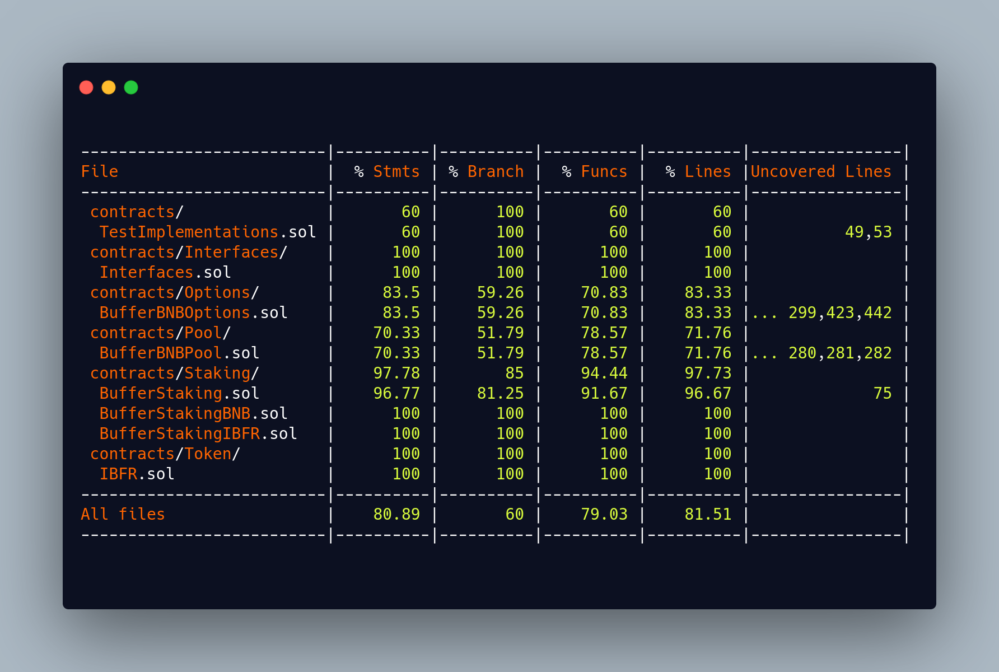

## Prerequisities

-   [Node.js v12.20.2][1]

## Install

```bash
npm install
```

## Tasks

### Start ganache

```bash
npm run ganache
```

### Run tests

```bash
npm run test
```

### Generate code coverage

```bash
npm run coverage
```




[1]: https://nodejs.org/

## Mainnet Contracts

### iBFR Token 
[0xa296aD1C47FE6bDC133f39555C1D1177BD51fBc5](https://bscscan.com/address/0xa296aD1C47FE6bDC133f39555C1D1177BD51fBc5)

### iBFR-BNB Staking Contract 
[0xe6c2cdd466eb1fa6bdfdb8af1bd072d4a57734c2](https://bscscan.com/address/0xe6c2cdd466eb1fa6bdfdb8af1bd072d4a57734c2)

### BNB Options Write Pool Contract
[0x7338ee5535F1E0f1a210a6Ef6dB34f5357EB9860](https://bscscan.com/address/0x7338ee5535F1E0f1a210a6Ef6dB34f5357EB9860)

### Farm rBFR-iBFR
__v1__: [0x99d2daB13F11c698B7B66D48b81e5980f923201E](https://bscscan.com/address/0x99d2daB13F11c698B7B66D48b81e5980f923201E)
__v2__: [0xac5F9128FE1BD35DA505358dc4C08BABB535CCa6](https://bscscan.com/address/0xac5F9128FE1BD35DA505358dc4C08BABB535CCa6)

### BufferBNBOptions Contract
[0x1Ee5325eC7EEE1C8495E67B431e5D96BABfF965d](https://bscscan.com/address/0x1Ee5325eC7EEE1C8495E67B431e5D96BABfF965d)

## Testnet Contracts

### BufferBNBOptions
[0x87B690161B6C8d4aa490EC2aA5BB08569D0CFf3A](https://testnet.bscscan.com/address/0x87B690161B6C8d4aa490EC2aA5BB08569D0CFf3A#contracts)

### BufferStakingBNB
[0x6D318d7a200f62eB66F3eb86f7EcBB03440e9482](https://testnet.bscscan.com/address/0x6D318d7a200f62eB66F3eb86f7EcBB03440e9482#contracts)

### BufferStakingIBFR
[0x6899ab5c75258886202b32960505563Fb5acF89a](https://testnet.bscscan.com/address/0x6899ab5c75258886202b32960505563Fb5acF89a#contracts)

### BufferBNBPool
[0x4C989a68450D341c4562693057F328aF98327ab4](https://testnet.bscscan.com/address/0x4C989a68450D341c4562693057F328aF98327ab4#contracts)

### IBFR
[0xa9377a4700a23BF0FCA539553C4979CF904Aa726](https://testnet.bscscan.com/address/0xa9377a4700a23BF0FCA539553C4979CF904Aa726#contracts)

### FakePriceProvider

> Only being used for testing, We'll be using Chainlink on the mainnet

#### [0x200073FfA24625e003ECd84f04518D08Bb5345b7](https://testnet.bscscan.com/address/0x200073FfA24625e003ECd84f04518D08Bb5345b7#contracts)
